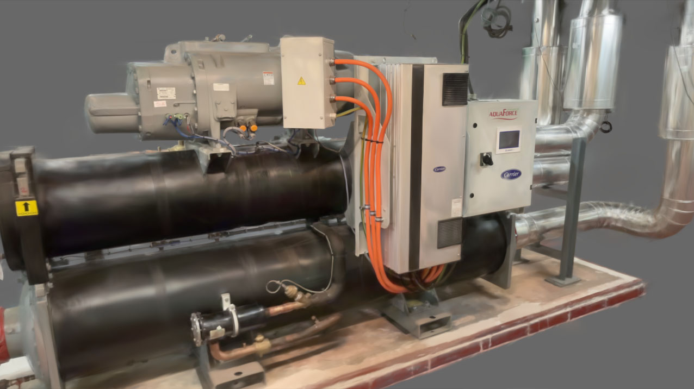
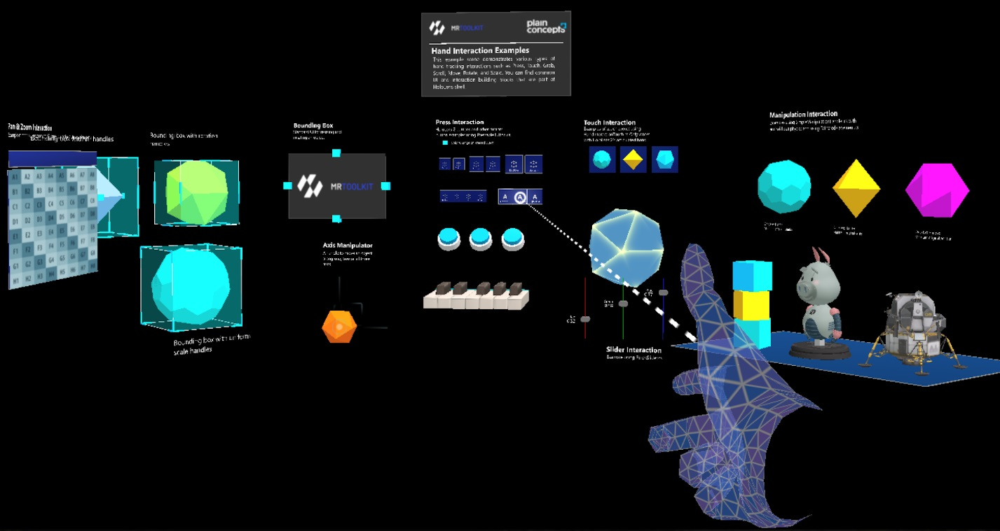
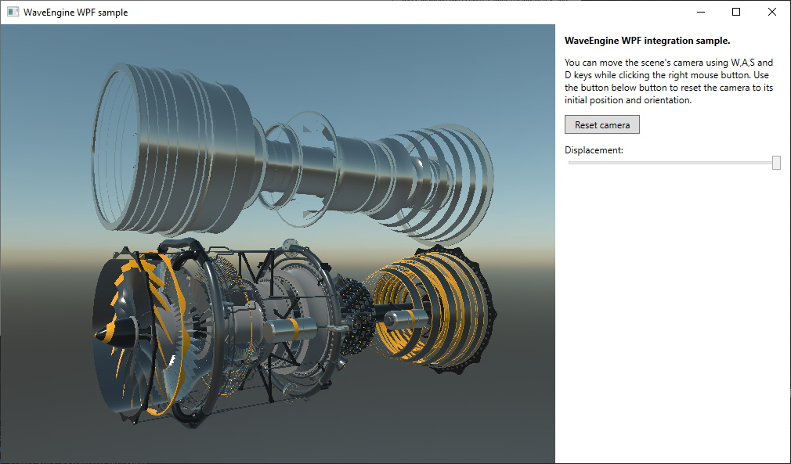
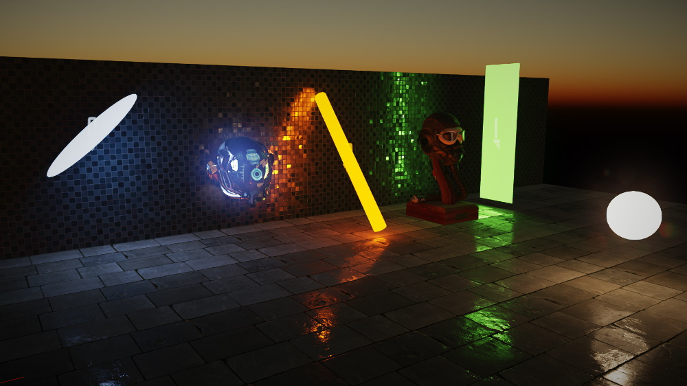
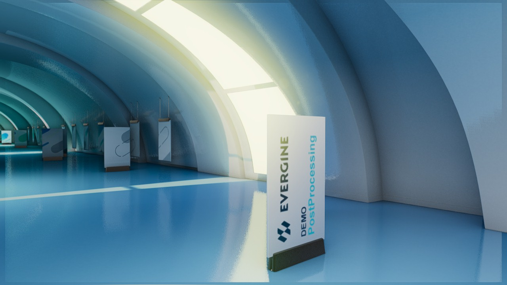

# Evergine Samples

This repository contains all the samples code that are part of any topic under the last Evergine stable version based on .NET 6.

We are using different Github repositories to make it easy to download each of them individually. The complete list of samples is using Evergine 2023.9.28 and to build these you only need to restore the Nuget dependencies and build the project respectively.

# Samples list.

## MAUI showcase
This showcase demonstrates the seamless integration of __MAUI__ and __Evergine__. Leveraging the latest Evergine release, you can access a new MAUI project template, enabling the creation of exceptional mobile applications for both Android and iOS. This template facilitates the development of captivating UIs with MAUI, allowing for the inclusion of a 3D canvas in your views to render engaging 3D content.

Source Code: https://github.com/EvergineTeam/EverSneaks

## Vehicle Physics Sample
This sample shows how you can use Evergine to perform vehicle physics simulations that interact with other physics elements.

Source Code: https://github.com/EvergineTeam/VehiclePhysicsSample

## Physics Joints Sample
This sample shows the different types of physics joints that you can use Evergine to enhance your physics simulations.

Source Code: https://github.com/EvergineTeam/PhysicsJointsSample

## Gaussian Splatting Demo
In this sample you can explore Gaussian Splatting technology using Evergine. You can navigate through a Gaussian Splatting scene and use this code base to extend and explore new possibilities.

Source Code: [https://github.com/EvergineTeam/NeRF-Demo](https://github.com/EvergineTeam/GaussianSplatting-Demo)

## NeRF Demo
In this NeRF sample you can explore Neural Radiance Field technology using Evergine. You can navigate through a NeRF scene and use this code base to extend and explore new possibilities.

Source Code: https://github.com/EvergineTeam/NeRF-Demo

## XRV Sample
Sample of our XRV library (preview) working within its public modules.

Source Code: https://github.com/EvergineTeam/XRV

## XR Sample
This demo shows how you can use Evergine in an VR application using OpenXR. In this sample you can control a robot arm using your motion controllers

Source Code: https://github.com/EvergineTeam/XRSample

## Raytracing Demo
This is a toy path tracer that shows how to implement advanced raytracing effects as Soft Shadows, Ambient Occlusion, Global Illumination, or Antialiasing using the common raytracing API include in Evergine.

Source Code: https://github.com/EvergineTeam/Raytracing

## Automotive Demo
This demo shows how you can use Evergine in an automotive application environment. It uses a simple WPF user interface integration with Evergine to control different parts of the car.

Source Code: https://github.com/EvergineTeam/Automotive-Demo

## Smart City Demo
This demo uses a backed map 3D model to implement a simple interaction and navigation.

Source Code: https://github.com/EvergineTeam/SmartCityDemo

## Digital Twin Demo
Digital Twin Web application sample (WebGL) based on a solar energy field. It simulates a time-lapse and how users could check different measurements related to tracker angles, voltage, or intensity.

Source Code: https://github.com/EvergineTeam/DigitalTwin-Demo

## Mixed Reality Demo
Evergine.MRTK is a project that provides a set of components and features used to accelerate cross-platform XR application development in Evergine.

Source Code: https://github.com/EvergineTeam/MixedRealityToolkit

## UI API integrations
This demo shows how you can integrate Evergine in an application using the WindowSystem. The Windows Forms and SDL uses the full window to render the application and the WPF sample demonstrates a way to include a Evergine renderer and how it can interact with WPF controls.

Source Code: https://github.com/EvergineTeam/UIWindowSystemsDemo

## Particles demo
This demo uses the power of compute shaders to simulate differents particle system scenarios.

Source Code: https://github.com/EvergineTeam/ParticlesSample

## Area Lights demo
This demo uses the Evergine Area Light capabilities to create special soft light effects.

Source Code: https://github.com/EvergineTeam/AreaLightsDemo

## The standard post-processing graph
This demo scene uses Evergine with .NET 6 support. The new Post-processing graph is used with several effects such as Screen Space Ambient Occlusion (SSAO), Screen Space Reflection (SSR), Temporal Antialiasing (TAA), Depth of Field (DoF), Bloom, and Tonemapping and you can check it on DirectX11, DirectX12, and Vulkan.

Source Code: https://github.com/EvergineTeam/PostProcessing

## ImGui, ImPlot, ImGuizmo and ImNodes demo
This sample shows how to use the ImGui extension in Evergine. The sample includes code for test the ImGui, ImPlot, ImGuizmo and ImNodes.

Source Code: https://github.com/EvergineTeam/ImGui-Demo

## Low Level API
Set of samples using the Low-Level abstraction API over Vulkan, DirectX, OpenGL, Metal.

Source Code: https://github.com/EvergineTeam/LowLevelAPIDemo
